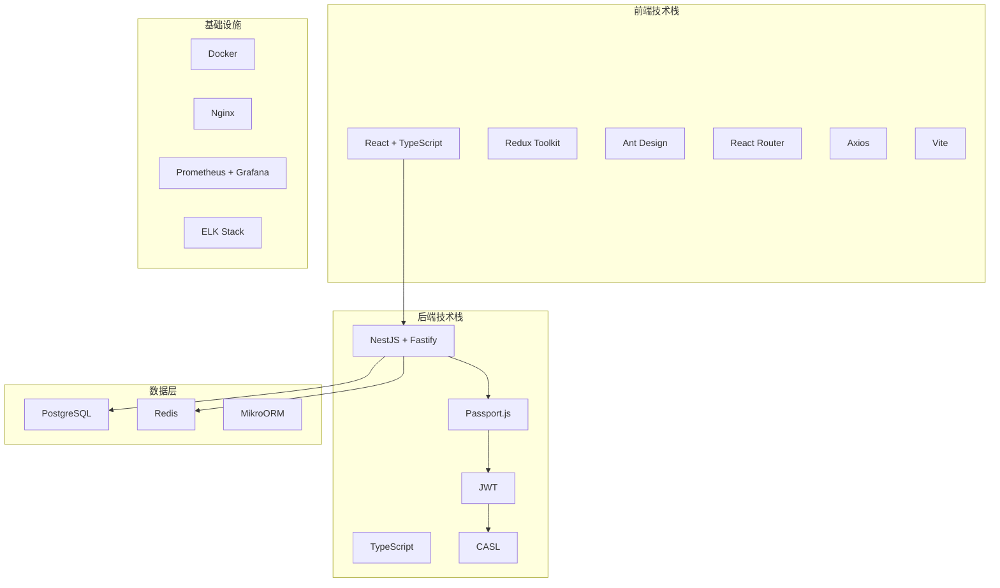

# 11 - IAM领域模块技术设计指南

## 📋 文档信息

- **文档类型**: IAM领域模块技术设计指南
- **文档版本**: v1.0
- **创建日期**: 2024年12月
- **最后更新**: 2024年12月
- **文档状态**: 实施版
- **目标读者**: 全栈工程师、IAM开发者、架构师

---

## 📋 文档概述

本文档作为IAM系统技术设计的总索引，涵盖了从整体架构到具体实现的各个方面。IAM（Identity and Access Management）是整个平台的核心领域模块，负责身份认证、权限管理、多租户隔离等关键功能。

## 📚 详细设计文档

IAM系统的完整技术设计分为四个主要部分，每个部分都有详细的技术文档：

### 1. 🏗️ 整体技术设计方案

- **文件**: [iam-design/iam-technical-design.md](./iam-design/iam-technical-design.md)
- **内容**: 整体架构设计、技术栈选择、安全架构、数据架构等
- **重点**: 系统整体架构和技术选型
- **适用读者**: 架构师、技术负责人

### 2. 🌐 API设计与服务实现

- **文件**: [iam-design/iam-technical-design-part2.md](./iam-design/iam-technical-design-part2.md)
- **内容**: API设计规范、服务层实现、命令查询处理器、事件处理器等
- **重点**: 应用层和接口层的详细设计
- **适用读者**: 开发工程师、API开发者

### 3. ⚡ 高级功能设计

- **文件**: [iam-design/iam-technical-design-part3.md](./iam-design/iam-technical-design-part3.md)
- **内容**: 缓存架构、通知服务、监控告警、日志管理等
- **重点**: 系统的高级功能和性能优化
- **适用读者**: 性能工程师、运维工程师

### 4. 🔌 第三方依赖集成

- **文件**: [iam-design/iam-dependencies-integration.md](./iam-design/iam-dependencies-integration.md)
- **内容**: Passport.js、JWT、CASL等第三方依赖的集成方案
- **重点**: 第三方依赖的选择和集成策略
- **适用读者**: 开发工程师、集成工程师

## 🎯 文档阅读策略

### 按角色分类阅读

| 角色              | 优先阅读文档            | 重点关注内容                 |
| ----------------- | ----------------------- | ---------------------------- |
| **🏗️ 架构师**     | 整体技术设计方案        | 系统架构、技术选型、安全架构 |
| **👨‍💻 开发团队**   | 所有文档（重点API设计） | API设计、服务实现、依赖集成  |
| **🔧 技术负责人** | 整体设计 + 依赖集成     | 架构决策、集成方案、风险评估 |
| **⚡ 性能工程师** | 高级功能设计            | 缓存架构、性能优化、监控告警 |
| **🔒 安全工程师** | 整体设计 + 依赖集成     | 安全架构、认证方案、权限管理 |

### 按开发阶段阅读

| 阶段            | 必读文档           | 阅读目的               |
| --------------- | ------------------ | ---------------------- |
| **📐 设计阶段** | 整体技术设计方案   | 理解系统架构和技术选型 |
| **💻 开发阶段** | API设计 + 依赖集成 | 指导具体开发实现       |
| **🚀 优化阶段** | 高级功能设计       | 性能优化和功能增强     |
| **🔧 维护阶段** | 所有文档           | 系统维护和问题排查     |

## 🏗️ IAM技术架构概览

### 架构组成

```
IAM领域模块技术架构
├── 🏗️ 整体架构设计
│   ├── 📐 架构模式: DDD + Event Sourcing + CQRS
│   ├── 🛠️ 技术栈: NestJS + TypeScript + PostgreSQL + Redis
│   ├── 🔒 安全架构: Passport.js + JWT + CASL
│   └── 🗄️ 数据架构: 多租户隔离 + 事件溯源
│
├── 🌐 API与服务设计
│   ├── 📡 RESTful API设计规范
│   ├── 💼 应用服务实现模式
│   ├── ⚡ 命令查询处理器(CQRS)
│   └── 🔄 事件处理器(Event Handlers)
│
├── ⚡ 高级功能设计
│   ├── 🗄️ 多级缓存架构
│   ├── 📢 通知服务集成
│   ├── 📊 监控告警体系
│   └── 📋 结构化日志管理
│
└── 🔌 第三方依赖集成
    ├── 🔐 Passport.js认证框架
    ├── 🎫 JWT令牌服务
    ├── 👮 CASL权限管理
    └── 🚀 性能优化策略
```

### 技术栈全景



## 🔐 核心技术栈详解

### 后端技术栈

| 技术组件              | 版本要求 | 用途说明        | 关键特性                 |
| --------------------- | -------- | --------------- | ------------------------ |
| **🏗️ NestJS**         | ^10.0.0  | Node.js应用框架 | 依赖注入、装饰器、模块化 |
| **⚡ Fastify**        | ^4.0.0   | HTTP服务器      | 高性能、低延迟、丰富插件 |
| **📝 TypeScript**     | ^5.0.0   | 编程语言        | 类型安全、开发效率       |
| **🔐 Passport.js**    | ^0.6.0   | 认证框架        | 多策略认证、中间件支持   |
| **🎫 @nestjs/jwt**    | ^10.0.0  | JWT处理         | 令牌生成、验证、刷新     |
| **🔑 passport-local** | ^1.0.0   | 本地认证        | 用户名密码认证           |
| **👮 CASL**           | ^6.0.0   | 权限管理        | 声明式权限、条件控制     |
| **🗄️ PostgreSQL**     | ^15.0    | 主数据库        | ACID事务、JSON支持       |
| **⚡ Redis**          | ^7.0.0   | 缓存数据库      | 高性能缓存、会话存储     |
| **🔄 MikroORM**       | ^5.0.0   | ORM框架         | 类型安全、装饰器风格     |

### 认证与安全技术栈

```typescript
/**
 * IAM认证技术栈配置示例
 */
// Passport.js策略配置
@Injectable()
export class AuthenticationModule {
  constructor() {
    // JWT策略
    passport.use(
      new JwtStrategy({
        jwtFromRequest: ExtractJwt.fromAuthHeaderAsBearerToken(),
        ignoreExpiration: false,
        secretOrKey: process.env.JWT_SECRET,
      }),
    );

    // 本地认证策略
    passport.use(
      new LocalStrategy({
        usernameField: 'email',
        passwordField: 'password',
      }),
    );
  }
}

// CASL权限定义
@Injectable()
export class CaslAbilityFactory {
  createForUser(user: User): AppAbility {
    const { can, cannot, build } = new AbilityBuilder<AppAbility>(Ability);

    // 基于角色的权限
    if (user.role === 'admin') {
      can('manage', 'all');
    } else {
      can('read', 'User', { organizationId: user.organizationId });
      can('update', 'User', { id: user.id });
    }

    return build();
  }
}
```

## 🚀 核心特性实现

### 1. 🏢 多租户架构

- **租户级数据隔离**: 基于 tenantId 的数据分离
- **组织级权限控制**: 细粒度的组织权限管理
- **部门级数据访问**: 层级化的数据访问控制

```typescript
/**
 * 多租户数据隔离装饰器
 */
@Injectable()
export class TenantIsolationInterceptor implements NestInterceptor {
  intercept(context: ExecutionContext, next: CallHandler): Observable<any> {
    const request = context.switchToHttp().getRequest();
    const user = request.user;

    // 设置租户上下文
    TenantContext.setTenantId(user.tenantId);

    return next.handle().pipe(finalize(() => TenantContext.clear()));
  }
}
```

### 2. ⚡ 事件驱动架构

- **完整的事件溯源**: 记录所有业务事件
- **事件存储和重放**: 支持历史状态恢复
- **审计追踪能力**: 完整的操作审计链

```typescript
/**
 * 事件溯源实现示例
 */
@Injectable()
export class UserEventStore {
  async saveEvent(event: DomainEvent): Promise<void> {
    await this.eventRepository.save({
      aggregateId: event.aggregateId,
      eventType: event.eventType,
      eventData: event.eventData,
      version: event.version,
      timestamp: new Date(),
    });
  }

  async getEventsByAggregateId(aggregateId: string): Promise<DomainEvent[]> {
    const events = await this.eventRepository.findByAggregateId(aggregateId);
    return events.map(event => this.deserializeEvent(event));
  }
}
```

### 3. 🔒 权限管理系统

- **基于CASL的声明式权限**: 灵活的权限定义
- **条件权限控制**: 基于上下文的动态权限
- **多层级权限继承**: 层级化的权限继承机制

### 4. 🔐 认证安全体系

- **JWT令牌认证**: 无状态令牌认证
- **多策略认证支持**: 本地、OAuth、SSO等
- **安全会话管理**: 安全的会话生命周期管理

### 5. 🚀 性能优化机制

- **多级缓存架构**: L1内存缓存 + L2 Redis缓存
- **数据库查询优化**: 索引优化、查询优化
- **API性能优化**: 响应压缩、请求限流

## 📋 实施计划与里程碑

### 🎯 总体时间规划：12-15周

| 阶段            | 时间  | 主要任务     | 交付物                |
| --------------- | ----- | ------------ | --------------------- |
| **🏗️ 第一阶段** | 2-3周 | 基础架构搭建 | 基础DDD架构、认证集成 |
| **💻 第二阶段** | 4-5周 | 核心功能开发 | 租户、用户、权限管理  |
| **⚡ 第三阶段** | 3-4周 | 高级功能实现 | 事件溯源、缓存、通知  |
| **🔧 第四阶段** | 2-3周 | 优化与测试   | 性能优化、安全加固    |

### 第一阶段：基础架构 (2-3周) 🏗️

1. **搭建开发环境**
   - Docker容器化环境
   - 数据库初始化
   - 基础项目结构

2. **实现基础DDD架构**
   - 领域模型定义
   - 仓储模式实现
   - 事件基础设施

3. **集成Passport.js认证**
   - JWT策略配置
   - 本地认证策略
   - 认证中间件

4. **实现JWT服务**
   - 令牌生成服务
   - 令牌验证机制
   - 刷新令牌逻辑

5. **集成CASL权限管理**
   - 权限定义系统
   - 权限检查装饰器
   - 动态权限计算

### 第二阶段：核心功能 (4-5周) 💻

1. **实现租户管理**
   - 租户创建、更新、删除
   - 租户配置管理
   - 多租户数据隔离

2. **实现组织架构管理**
   - 组织CRUD操作
   - 组织层级管理
   - 组织权限控制

3. **实现用户管理**
   - 用户注册、登录
   - 用户信息管理
   - 用户状态管理

4. **实现角色权限管理**
   - 角色定义和管理
   - 权限分配机制
   - 权限继承逻辑

### 第三阶段：高级功能 (3-4周) ⚡

1. **实现事件溯源**
   - 事件存储机制
   - 事件重放功能
   - 快照机制

2. **实现通知服务**
   - 多渠道通知
   - 通知模板管理
   - 通知状态追踪

3. **实现缓存优化**
   - 多级缓存策略
   - 缓存失效机制
   - 缓存性能监控

4. **实现监控告警**
   - 系统性能监控
   - 业务指标监控
   - 智能告警机制

### 第四阶段：优化和测试 (2-3周) 🔧

1. **性能优化**
   - 数据库性能调优
   - API响应优化
   - 缓存策略优化

2. **安全加固**
   - 安全审计
   - 漏洞扫描
   - 权限检查

3. **全面测试**
   - 单元测试
   - 集成测试
   - 性能测试

4. **文档完善**
   - API文档
   - 部署文档
   - 运维手册

## 🔍 风险评估与应对

### 技术风险识别

| 风险类型          | 风险等级 | 影响范围     | 应对策略             |
| ----------------- | -------- | ------------ | -------------------- |
| **⚡ 性能风险**   | 🔴 高    | 系统响应时间 | 充分的性能测试和优化 |
| **🔒 安全风险**   | 🔴 高    | 数据安全     | 安全审计和渗透测试   |
| **🔧 可用性风险** | 🟡 中    | 服务可用性   | 高可用架构和故障恢复 |
| **📈 扩展性风险** | 🟡 中    | 系统扩展能力 | 模块化设计和水平扩展 |

### 风险应对策略

#### 1. 🔴 高风险应对

- **性能风险**:
  - 建立完善的性能测试体系
  - 实施多级缓存策略
  - 数据库查询优化
  - 定期性能调优

- **安全风险**:
  - 实施多层安全防护
  - 定期安全审计
  - 权限最小化原则
  - 安全培训和意识提升

#### 2. 🟡 中等风险应对

- **可用性风险**:
  - 实施高可用架构
  - 建立故障恢复机制
  - 监控和告警系统
  - 灾难恢复预案

- **扩展性风险**:
  - 采用模块化设计
  - 支持水平扩展
  - 微服务准备
  - 容器化部署

## 📚 参考资料与学习资源

### 官方文档

1. **[NestJS官方文档](https://nestjs.com/)** - 框架核心概念和最佳实践
2. **[Passport.js官方文档](http://www.passportjs.org/)** - 认证策略和中间件
3. **[CASL官方文档](https://casl.js.org/)** - 权限管理和访问控制
4. **[JWT官方文档](https://jwt.io/)** - JSON Web Token标准
5. **[MikroORM官方文档](https://mikro-orm.io/)** - TypeScript ORM框架

### 架构设计参考

1. **[领域驱动设计指南](https://martinfowler.com/bliki/DomainDrivenDesign.html)** - DDD核心概念
2. **[事件驱动架构指南](https://martinfowler.com/articles/201701-event-driven.html)** - EDA设计模式
3. **[微服务架构指南](https://martinfowler.com/microservices/)** - 微服务设计原则
4. **[CQRS模式指南](https://martinfowler.com/bliki/CQRS.html)** - 命令查询分离

### 业务需求文档

1. **[IAM业务需求文档](./01-iam-business-requirements.md)** - 核心业务需求
2. **[数据隔离需求文档](../../../business-requirements/data-isolation-business-requirements.md)** - 多租户隔离需求
3. **[安全合规需求文档](../../../business-requirements/security-compliance-business-requirements.md)** - 安全合规要求

### 架构指导文档

1. **[混合架构总览](./03-hybrid-architecture-overview.md)** - 整体架构设计
2. **[共享层开发指南](./05-shared-layer-development-guide.md)** - 基础组件设计
3. **[领域层开发指南](./06-domain-layer-development-guide.md)** - 领域层实现
4. **[应用层开发指南](./07-application-layer-development-guide.md)** - 应用层实现
5. **[基础设施层指南](./08-infrastructure-layer-development-guide.md)** - 基础设施实现

## 📞 技术支持与联系方式

### 开发团队联系

如有技术问题或建议，请联系相应的团队：

| 角色              | 职责范围           | 联系方式 |
| ----------------- | ------------------ | -------- |
| **🏗️ 技术架构师** | 架构设计、技术选型 | [待补充] |
| **👨‍💻 技术负责人** | 技术决策、开发指导 | [待补充] |
| **🔒 安全专家**   | 安全架构、安全审计 | [待补充] |
| **⚡ 性能专家**   | 性能优化、监控告警 | [待补充] |

### 技术讨论与协作

- **技术讨论**: 定期技术评审会议
- **代码审查**: Pull Request审查机制
- **知识分享**: 技术分享会和文档维护
- **问题跟踪**: Issue管理和问题解决流程

---

## 🎯 总结

IAM领域模块作为整个平台的核心，采用了现代化的技术架构和最佳实践：

### 核心价值

1. **🔒 安全性**: 多层安全防护，满足企业级安全要求
2. **🚀 性能**: 高性能架构设计，支持大规模并发
3. **📈 可扩展**: 模块化设计，支持灵活扩展
4. **🔧 可维护**: 清晰的架构分层，易于维护和升级

### 技术优势

1. **📐 现代化技术栈**: TypeScript + NestJS + PostgreSQL
2. **🏗️ 成熟的架构模式**: DDD + Event Sourcing + CQRS
3. **🔐 企业级安全**: Passport.js + JWT + CASL
4. **⚡ 高性能设计**: 多级缓存 + 数据库优化

### 实施保障

1. **📋 详细的设计文档**: 四部分完整技术设计
2. **🎯 清晰的实施计划**: 分阶段实施策略
3. **🔍 全面的风险评估**: 识别风险并制定应对策略
4. **📚 丰富的参考资料**: 官方文档和最佳实践

通过遵循本技术设计指南，可以构建出一个安全、高效、可扩展的IAM系统，为整个平台提供坚实的身份认证和权限管理基础。

---

_本文档将根据项目进展和技术发展持续更新和完善。_
